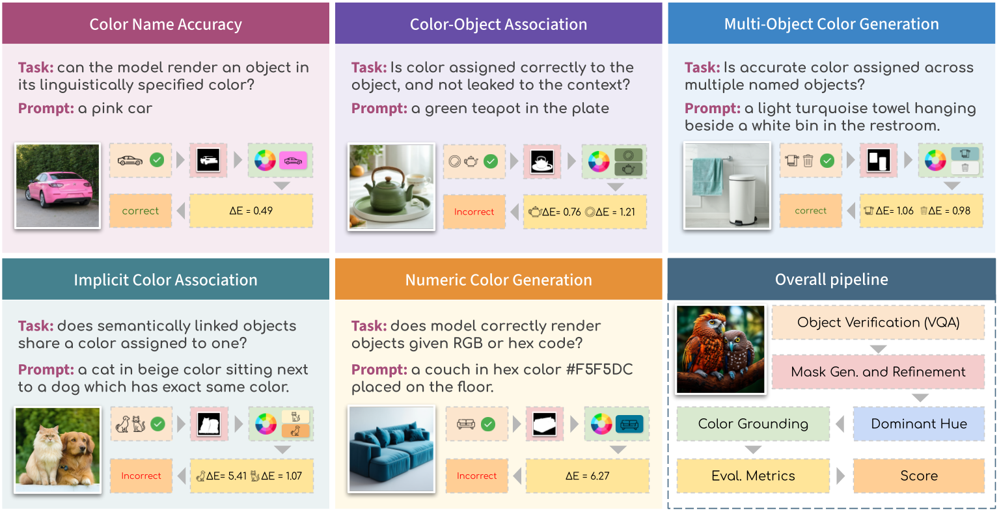

## GenColorBench: A Color Evaluation Benchmark for Text-to-Image Generation

<p align="center">
  
</p>

<p align="center">
  <a href="https://arxiv.org/abs/2510.20586"></a>
  <a href="https://moatifbutt.github.io/gencolorbench"></a>
  <a href="#license"></a>
</p>

**GenColorBench** is a comprehensive benchmark for evaluating color understanding capabilities in text-to-image (T2I) generation models. It systematically tests models across five tasks spanning explicit color naming, numerical color specifications, color-object associations, multi-object compositions, and implicit color understanding.

> **IEEE/CVF Conference on Computer Vision and Pattern Recognition (CVPR) 2026**

## Key Features

- **5 Evaluation Tasks**: CNA, NCU, COA, MOC, ICA covering diverse color understanding capabilities
- **2 Color Systems**: ISCC-NBS (L1/L2/L3 granularities) and CSS3/X11 (147 web colors)
- **Automated Pipeline**: GroundingDINO + SAM2 + OneHue + CIEDE2000 for objective evaluation
- **Mini Benchmark**: ~10K stratified prompts for compute-efficient community evaluation
- **Full Benchmark**: ~44K prompts for comprehensive analysis

## Tasks Overview

| Task | Abbrev. | Description | Example Prompt |
|------|---------|-------------|----------------|
| Color Name Accuracy | **CNA** | Generate object in named color | *"A vivid red car"* |
| Numerical Color Understanding | **NCU** | Generate object from RGB/HEX spec | *"A RGB(255,0,128) balloon"* |
| Color-Object Association | **COA** | Color one object, leave another natural | *"A blue apple next to a banana"* |
| Multi-Object Composition | **MOC** | Assign distinct colors to multiple objects | *"A red car and a green bicycle"* |
| Implicit Color Association | **ICA** | Infer color from contextual reference | *"A car the color of the sky"* |

## Installation

```bash
# Clone repository
git clone https://github.com/moatifbutt/gen-color-bench.git
cd gencolorbench

# Create environment
conda create -n gencolorbench python=3.10
conda activate gencolorbench

# Install dependencies
pip install -r requirements.txt

# Install SAM2 and GroundingDINO (for evaluation)
pip install segment-anything-2
pip install groundingdino-py
```

## Quick Start

### 1. Generate Benchmark Prompts

```bash
# Generate Mini benchmark (~10K prompts, recommended for initial evaluation)
python -m gencolorbench mini --output-dir ./mini_bench_prompt --seed 42

# Generate Full benchmark (~44K prompts)
python -m gencolorbench full --output-dir ./full_bench_prompt --seed 42
```

### 2. Generate Images

```bash
# Using FLUX.1-dev
python -m gencolorbench.generation \
    --model flux-dev \
    --prompts-dir ./mini_bench_prompt \
    --output-dir ./generated_images/flux-dev \
    --images-per-prompt 4 \
    --device cuda:0
```

### 3. Run Evaluation

```bash
cd gsam2/

python eval_pipeline.py \
    --prompts-dir ../mini_bench_prompt \
    --images-dir ../generated_images/flux-dev \
    --output-dir ../eval_results/ \
    --neg-csv ../gencolorbench/data/objects/obj_neg.csv \
    --colors-dir ../gencolorbench/data/neighborhoods \
    --color-tables-dir ../gencolorbench/data/color_systems \
    --sam2-checkpoint ./checkpoints/sam2.1_hiera_large.pt \
    --images-per-prompt 4 \
    --task all \
    --save-viz \
    --device cuda:0
```

### 4. Aggregate Results

```bash
python aggregate_results.py \
    --results-dir ../eval_results/ \
    --neg-csv ../gencolorbench/data/objects/obj_neg.csv \
    --output ../eval_results/summary.json \
    --csv ../eval_results/summary.csv
```

## Evaluation Pipeline

<p align="center">
  
</p>

Our automated evaluation pipeline:

1. **Object Detection**: GroundingDINO localizes target objects
2. **Segmentation**: SAM2 generates precise object masks
3. **Color Extraction**: OneHue + PCA extracts dominant color in LAB space
4. **Color Matching**: CIEDE2000 (ΔE) computes perceptual color distance
5. **Accuracy**: Match against GT color with neighborhood tolerance

## Benchmark Structure

```
gencolorbench/
├── gencolorbench/
│   ├── data/
│   │   ├── color_systems/       # ISCC-NBS L1/L2/L3, CSS3/X11 color tables
│   │   ├── neighborhoods/       # Color neighborhood definitions
│   │   ├── objects/             # Object list with categories and negative labels
│   │   └── templates/           # Task 5 prompt templates
│   ├── evaluation/              # CNA, NCU, COA, MOC, ICA evaluators
│   ├── generation/              # T2I model wrappers
│   └── color/                   # Color space conversions, CIEDE2000
├── gsam2/                       # Evaluation entry point (run from here)
│   ├── eval_pipeline.py
│   ├── aggregate_results.py
│   └── checkpoints/             # SAM2 checkpoints
└── mini_bench_prompt/           # Generated prompt CSVs
```

## Color Systems

| System | Granularity | Colors | Description |
|--------|-------------|--------|-------------|
| ISCC-NBS L1 | Coarse | 13 | Basic hue categories (Red, Orange, Yellow, ...) |
| ISCC-NBS L2 | Medium | 29 | Intermediate distinctions |
| ISCC-NBS L3 | Fine | 267 | Full ISCC-NBS specification with modifiers |
| CSS3/X11 | Web | 147 | Standard web color names |

*Full results available in the paper and on the [project page](https://gencolorbench.github.io).*

## Citation

If you find GenColorBench useful in your research, please cite:

```bibtex
@inproceedings{butt2026gencolorbench,
  title={GenColorBench: A Comprehensive Benchmark for Color Understanding in Text-to-Image Generation},
  author={Butt, Muhammad Atif and Gomez-Villa, Alexandra and Wu, Tao and Vazquez-Corral, Javier and Van De Weijer, Joost and Wang, Kai},
  booktitle={Proceedings of the IEEE/CVF Conference on Computer Vision and Pattern Recognition (CVPR)},
  year={2026}
}
```

## Related Benchmarks

- [T2I-CompBench](https://github.com/Karine-Huang/T2I-CompBench) - Compositional T2I generation
- [GenEval](https://github.com/djghosh13/geneval) - Object-centric T2I evaluation
- [TIFA](https://github.com/Yushi-Hu/tifa) - Text-to-image faithfulness

## License

This project is licensed under the MIT License - see the [LICENSE](LICENSE) file for details.

## Acknowledgments

This work was supported by the Computer Vision Center (CVC) at Universitat Autònoma de Barcelona. We thank the developers of SAM2, GroundingDINO, and the T2I models evaluated in this benchmark.

---

<p align="center">
  <b>Questions?</b> Open an issue or contact <a href="mailto:mabutt@cvc.uab.es">mabutt@cvc.uab.es</a>
</p>
